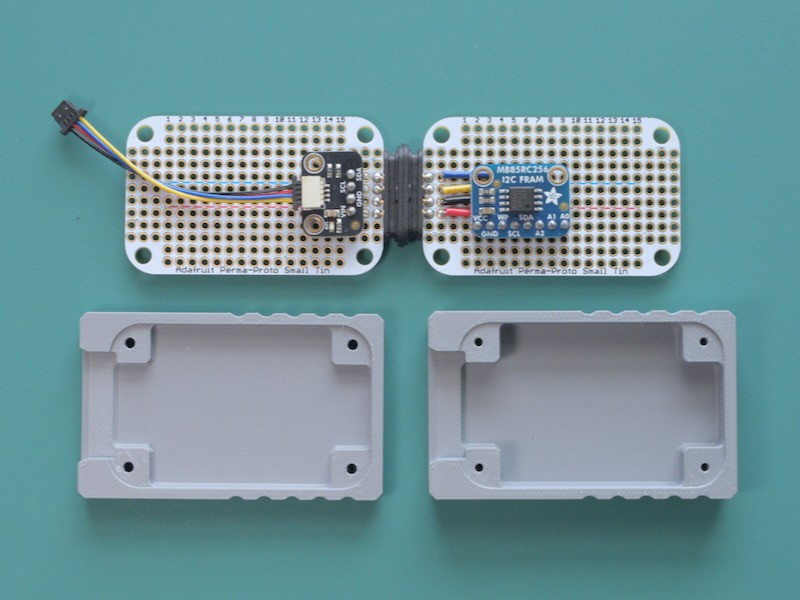
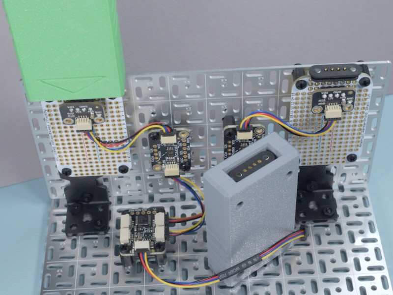

<!-- SPDX-License-Identifier: MIT -->
<!-- SPDX-FileCopyrightText: Copyright 2025 Sam Blenny -->
# Hot-Swap I2C FRAM





This repo has code and design files for hot-swappable I2C FRAM memory
cartridges meant for use with the TCA4307 hot-swap I2C buffer and PCA9546 I2C
multiplexer.

Related guide:
[I2C FRAM Memory Carts](https://adafruit-playground.com/u/SamBlenny/pages/i2c-fram-memory-carts)

Designed the cart shell with Blender 4.4 using lots of geometry node modifiers.
For STL, .3mf, and .blend files, check out `fram-cart*` in the top level of
this repo.

CircuitPython Library dependencies (see bundle_manifest.cfg):
- `adafruit_bus_device`
- `adafruit_fram`
- `adafruit_tca9548a`

The code detects whether you have a I2C multiplexer wired up and selects
between the one-slot and two-slot modes accordingly.


## Usage Example (two-slot build)

Here's a serial console log where I:

1. Start with both slots are empty
2. Slot gray FRAM cart into slot 0
3. Slot green FRAM cart into slot 1
4. Erase both carts
5. Set a new message for both carts
6. Remove both carts
7. Slot the carts back on the opposite slots

The lines with `Menu:` ... `choice [1]: ` are prompts to input a number to
make a selection from the menu of actions.

```
Slot 0: Empty

Slot 1: Empty

Menu:
 1  Scan for FRAM carts and print their header bytes
 2  Write message to slot 0 FRAM (max 64 bytes)
 3  Write message to slot 1 FRAM (max 64 bytes)
 4  Erase first 64 bytes (set to 0) of slot 0 FRAM
 5  Erase first 64 bytes (set to 0) of slot 1 FRAM
choice [1]: 1

Slot 0 fram_bytes[0:64]:
  54 68 69 73 20 69 73 20 74 68 65 20 67 72 61 79   This is the gray
  20 63 61 72 74 00 00 00 00 00 00 00 00 00 00 00    cart...........
  00 00 00 00 00 00 00 00 00 00 00 00 00 00 00 00   ................
  00 00 00 00 00 00 00 00 00 00 00 00 00 00 00 00   ................

Slot 1: Empty

Menu:
 1  Scan for FRAM carts and print their header bytes
 2  Write message to slot 0 FRAM (max 64 bytes)
 3  Write message to slot 1 FRAM (max 64 bytes)
 4  Erase first 64 bytes (set to 0) of slot 0 FRAM
 5  Erase first 64 bytes (set to 0) of slot 1 FRAM
choice [1]: 1

Slot 0 fram_bytes[0:64]:
  54 68 69 73 20 69 73 20 74 68 65 20 67 72 61 79   This is the gray
  20 63 61 72 74 00 00 00 00 00 00 00 00 00 00 00    cart...........
  00 00 00 00 00 00 00 00 00 00 00 00 00 00 00 00   ................
  00 00 00 00 00 00 00 00 00 00 00 00 00 00 00 00   ................

Slot 1 fram_bytes[0:64]:
  54 68 69 73 20 69 73 20 74 68 65 20 67 72 65 65   This is the gree
  6e 20 63 61 72 74 00 00 00 00 00 00 00 00 00 00   n cart..........
  00 00 00 00 00 00 00 00 00 00 00 00 00 00 00 00   ................
  00 00 00 00 00 00 00 00 00 00 00 00 00 00 00 00   ................

Menu:
 1  Scan for FRAM carts and print their header bytes
 2  Write message to slot 0 FRAM (max 64 bytes)
 3  Write message to slot 1 FRAM (max 64 bytes)
 4  Erase first 64 bytes (set to 0) of slot 0 FRAM
 5  Erase first 64 bytes (set to 0) of slot 1 FRAM
choice [1]: 4
ok

Slot 0 fram_bytes[0:64]:
  00 00 00 00 00 00 00 00 00 00 00 00 00 00 00 00   ................
  00 00 00 00 00 00 00 00 00 00 00 00 00 00 00 00   ................
  00 00 00 00 00 00 00 00 00 00 00 00 00 00 00 00   ................
  00 00 00 00 00 00 00 00 00 00 00 00 00 00 00 00   ................

Slot 1 fram_bytes[0:64]:
  54 68 69 73 20 69 73 20 74 68 65 20 67 72 65 65   This is the gree
  6e 20 63 61 72 74 00 00 00 00 00 00 00 00 00 00   n cart..........
  00 00 00 00 00 00 00 00 00 00 00 00 00 00 00 00   ................
  00 00 00 00 00 00 00 00 00 00 00 00 00 00 00 00   ................

Menu:
 1  Scan for FRAM carts and print their header bytes
 2  Write message to slot 0 FRAM (max 64 bytes)
 3  Write message to slot 1 FRAM (max 64 bytes)
 4  Erase first 64 bytes (set to 0) of slot 0 FRAM
 5  Erase first 64 bytes (set to 0) of slot 1 FRAM
choice [1]: 5
ok

Slot 0 fram_bytes[0:64]:
  00 00 00 00 00 00 00 00 00 00 00 00 00 00 00 00   ................
  00 00 00 00 00 00 00 00 00 00 00 00 00 00 00 00   ................
  00 00 00 00 00 00 00 00 00 00 00 00 00 00 00 00   ................
  00 00 00 00 00 00 00 00 00 00 00 00 00 00 00 00   ................

Slot 1 fram_bytes[0:64]:
  00 00 00 00 00 00 00 00 00 00 00 00 00 00 00 00   ................
  00 00 00 00 00 00 00 00 00 00 00 00 00 00 00 00   ................
  00 00 00 00 00 00 00 00 00 00 00 00 00 00 00 00   ................
  00 00 00 00 00 00 00 00 00 00 00 00 00 00 00 00   ................

Menu:
 1  Scan for FRAM carts and print their header bytes
 2  Write message to slot 0 FRAM (max 64 bytes)
 3  Write message to slot 1 FRAM (max 64 bytes)
 4  Erase first 64 bytes (set to 0) of slot 0 FRAM
 5  Erase first 64 bytes (set to 0) of slot 1 FRAM
choice [1]: 2
Message to write? (max 64 chars): GRAY CART
ok

Slot 0 fram_bytes[0:64]:
  47 52 41 59 20 43 41 52 54 00 00 00 00 00 00 00   GRAY CART.......
  00 00 00 00 00 00 00 00 00 00 00 00 00 00 00 00   ................
  00 00 00 00 00 00 00 00 00 00 00 00 00 00 00 00   ................
  00 00 00 00 00 00 00 00 00 00 00 00 00 00 00 00   ................

Slot 1 fram_bytes[0:64]:
  00 00 00 00 00 00 00 00 00 00 00 00 00 00 00 00   ................
  00 00 00 00 00 00 00 00 00 00 00 00 00 00 00 00   ................
  00 00 00 00 00 00 00 00 00 00 00 00 00 00 00 00   ................
  00 00 00 00 00 00 00 00 00 00 00 00 00 00 00 00   ................

Menu:
 1  Scan for FRAM carts and print their header bytes
 2  Write message to slot 0 FRAM (max 64 bytes)
 3  Write message to slot 1 FRAM (max 64 bytes)
 4  Erase first 64 bytes (set to 0) of slot 0 FRAM
 5  Erase first 64 bytes (set to 0) of slot 1 FRAM
choice [1]: 3
Message to write? (max 64 chars): GREEN CART
ok

Slot 0 fram_bytes[0:64]:
  47 52 41 59 20 43 41 52 54 00 00 00 00 00 00 00   GRAY CART.......
  00 00 00 00 00 00 00 00 00 00 00 00 00 00 00 00   ................
  00 00 00 00 00 00 00 00 00 00 00 00 00 00 00 00   ................
  00 00 00 00 00 00 00 00 00 00 00 00 00 00 00 00   ................

Slot 1 fram_bytes[0:64]:
  47 52 45 45 4e 20 43 41 52 54 00 00 00 00 00 00   GREEN CART......
  00 00 00 00 00 00 00 00 00 00 00 00 00 00 00 00   ................
  00 00 00 00 00 00 00 00 00 00 00 00 00 00 00 00   ................
  00 00 00 00 00 00 00 00 00 00 00 00 00 00 00 00   ................

Menu:
 1  Scan for FRAM carts and print their header bytes
 2  Write message to slot 0 FRAM (max 64 bytes)
 3  Write message to slot 1 FRAM (max 64 bytes)
 4  Erase first 64 bytes (set to 0) of slot 0 FRAM
 5  Erase first 64 bytes (set to 0) of slot 1 FRAM
choice [1]: 1

Slot 0: Empty

Slot 1: Empty

Menu:
 1  Scan for FRAM carts and print their header bytes
 2  Write message to slot 0 FRAM (max 64 bytes)
 3  Write message to slot 1 FRAM (max 64 bytes)
 4  Erase first 64 bytes (set to 0) of slot 0 FRAM
 5  Erase first 64 bytes (set to 0) of slot 1 FRAM
choice [1]: 1

Slot 0 fram_bytes[0:64]:
  47 52 45 45 4e 20 43 41 52 54 00 00 00 00 00 00   GREEN CART......
  00 00 00 00 00 00 00 00 00 00 00 00 00 00 00 00   ................
  00 00 00 00 00 00 00 00 00 00 00 00 00 00 00 00   ................
  00 00 00 00 00 00 00 00 00 00 00 00 00 00 00 00   ................

Slot 1 fram_bytes[0:64]:
  47 52 41 59 20 43 41 52 54 00 00 00 00 00 00 00   GRAY CART.......
  00 00 00 00 00 00 00 00 00 00 00 00 00 00 00 00   ................
  00 00 00 00 00 00 00 00 00 00 00 00 00 00 00 00   ................
  00 00 00 00 00 00 00 00 00 00 00 00 00 00 00 00   ................

Menu:
 1  Scan for FRAM carts and print their header bytes
 2  Write message to slot 0 FRAM (max 64 bytes)
 3  Write message to slot 1 FRAM (max 64 bytes)
 4  Erase first 64 bytes (set to 0) of slot 0 FRAM
 5  Erase first 64 bytes (set to 0) of slot 1 FRAM
choice [1]:
```


## Usage Example (one-slot build)

Here's a serial console log where I:

1. Start with the slot empty
2. Slot gray FRAM cart
3. Erase gray cart then change its message
3. Remove gray cart
4. Slot green cart then change its message

The lines with `Menu:` ... `choice [1]: ` are prompts to input a number to
make a selection from the menu of actions.

```
PCA9546A MUX NOT FOUND. STARTING IN ONE SLOT MODE.


Slot: Empty

Menu:
 1  Print FRAM cart header bytes
 2  Write message to FRAM (max 64 bytes)
 3  Erase first 64 bytes of FRAM
choice [1]: 1

fram_bytes[0:64]:
  47 52 41 59 20 43 41 52 54 00 00 00 00 00 00 00   GRAY CART.......
  00 00 00 00 00 00 00 00 00 00 00 00 00 00 00 00   ................
  00 00 00 00 00 00 00 00 00 00 00 00 00 00 00 00   ................
  00 00 00 00 00 00 00 00 00 00 00 00 00 00 00 00   ................

Menu:
 1  Print FRAM cart header bytes
 2  Write message to FRAM (max 64 bytes)
 3  Erase first 64 bytes of FRAM
choice [1]: 3
ok

fram_bytes[0:64]:
  00 00 00 00 00 00 00 00 00 00 00 00 00 00 00 00   ................
  00 00 00 00 00 00 00 00 00 00 00 00 00 00 00 00   ................
  00 00 00 00 00 00 00 00 00 00 00 00 00 00 00 00   ................
  00 00 00 00 00 00 00 00 00 00 00 00 00 00 00 00   ................

Menu:
 1  Print FRAM cart header bytes
 2  Write message to FRAM (max 64 bytes)
 3  Erase first 64 bytes of FRAM
choice [1]: 2
Message to write? (max 64 chars): This is the gray cart
ok

fram_bytes[0:64]:
  54 68 69 73 20 69 73 20 74 68 65 20 67 72 61 79   This is the gray
  20 63 61 72 74 00 00 00 00 00 00 00 00 00 00 00    cart...........
  00 00 00 00 00 00 00 00 00 00 00 00 00 00 00 00   ................
  00 00 00 00 00 00 00 00 00 00 00 00 00 00 00 00   ................

Menu:
 1  Print FRAM cart header bytes
 2  Write message to FRAM (max 64 bytes)
 3  Erase first 64 bytes of FRAM
choice [1]: 1

Slot: Empty

Menu:
 1  Print FRAM cart header bytes
 2  Write message to FRAM (max 64 bytes)
 3  Erase first 64 bytes of FRAM
choice [1]: 1

fram_bytes[0:64]:
  47 52 45 45 4e 20 43 41 52 54 00 00 00 00 00 00   GREEN CART......
  00 00 00 00 00 00 00 00 00 00 00 00 00 00 00 00   ................
  00 00 00 00 00 00 00 00 00 00 00 00 00 00 00 00   ................
  00 00 00 00 00 00 00 00 00 00 00 00 00 00 00 00   ................

Menu:
 1  Print FRAM cart header bytes
 2  Write message to FRAM (max 64 bytes)
 3  Erase first 64 bytes of FRAM
choice [1]: 3
ok

fram_bytes[0:64]:
  00 00 00 00 00 00 00 00 00 00 00 00 00 00 00 00   ................
  00 00 00 00 00 00 00 00 00 00 00 00 00 00 00 00   ................
  00 00 00 00 00 00 00 00 00 00 00 00 00 00 00 00   ................
  00 00 00 00 00 00 00 00 00 00 00 00 00 00 00 00   ................

Menu:
 1  Print FRAM cart header bytes
 2  Write message to FRAM (max 64 bytes)
 3  Erase first 64 bytes of FRAM
choice [1]: 2
Message to write? (max 64 chars): This is the green cart
ok

fram_bytes[0:64]:
  54 68 69 73 20 69 73 20 74 68 65 20 67 72 65 65   This is the gree
  6e 20 63 61 72 74 00 00 00 00 00 00 00 00 00 00   n cart..........
  00 00 00 00 00 00 00 00 00 00 00 00 00 00 00 00   ................
  00 00 00 00 00 00 00 00 00 00 00 00 00 00 00 00   ................

Menu:
 1  Print FRAM cart header bytes
 2  Write message to FRAM (max 64 bytes)
 3  Erase first 64 bytes of FRAM
choice [1]:
```
